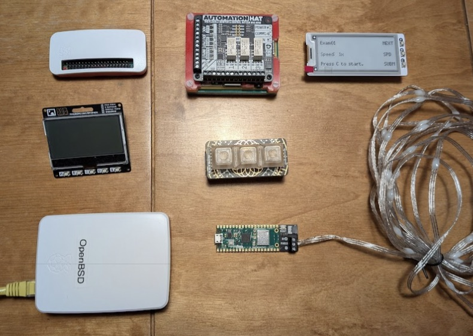
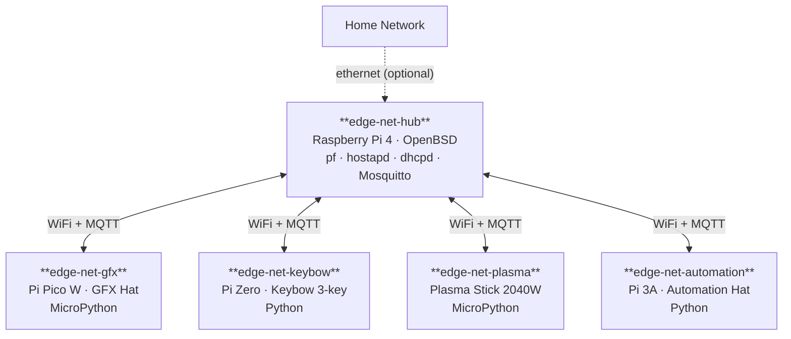

# Edge-NET

A self-contained wireless edge network built from Raspberry Pi hardware, running on an OpenBSD router with pf packet filtering. Nodes communicate over a dedicated WiFi network — no internet required — using MQTT as the message bus.

Designed as a portable demo: plug in power and everything talks to each other. Plug in an ethernet cable and additional features unlock (Prometheus/Grafana monitoring on the home network).

## Nodes

| Repo | Hardware | Role |
| ---- | -------- | ---- |
| [edge-net-hub](https://github.com/jackwaddington/edge-net-hub) | Raspberry Pi 4 · OpenBSD | Router, firewall (pf), WiFi AP, MQTT broker |
| [edge-net-gfx](https://github.com/jackwaddington/edge-net-gfx) | Pi Pico W · Pimoroni GFX Hat | MQTT subscriber, drives a small display |
| [edge-net-keybow](https://github.com/jackwaddington/edge-net-keybow) | Pi Zero · Keybow 3-key | 3 buttons that publish MQTT messages |
| [edge-net-plasma](https://github.com/jackwaddington/edge-net-plasma) | Plasma Stick 2040W | LED strip controlled via MQTT |
| [edge-net-automation](https://github.com/jackwaddington/edge-net-automation) | Pi 3A · Automation Hat | Relay control, graceful shutdown of nodes |

## Architecture

## Network

The hub creates a WiFi access point that all nodes connect to. OpenBSD's pf (packet filter) controls traffic between nodes and — when the ethernet uplink is present — out to the home network.

When running standalone (no ethernet): all inter-node MQTT communication works normally. Features that depend on the home network (e.g. Prometheus/Grafana on the GFX display) degrade gracefully when the uplink is absent.

## MQTT message bus

Mosquitto runs on the hub and acts as the broker for all node communication. Nodes publish to topics and subscribe to topics to react to each other.

Example flows:

- Keybow button press → MQTT publish → Plasma Stick changes LED pattern
- Keybow button press → MQTT publish → GFX hat updates its display
- Automation hat receives MQTT command → SSH shutdown → relay cuts power

## Status

Early stage — hardware in hand, repos being built out per node.
